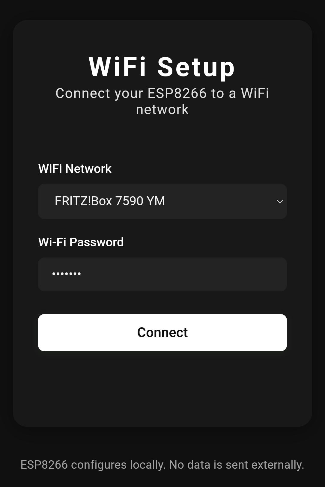

# ESP8266 CaptivePortal Example Project

This is a simple example project demonstrating how to use the [CaptivePortal](https://github.com/lennart080/CaptivePortal) library on the ESP8266.  
It provides a WiFi setup portal, allowing users to connect the ESP8266 to a WiFi network using a web interface.

> **Note:** The CaptivePortal library is not limited to WiFi setup!  
> You can use it to host any kind of website (with HTML, CSS, and JS) directly from your ESP8266, making it easy to build custom configuration portals, dashboards, or interactive device UIs.

## Preview



*Example of the WiFi setup portal web interface, served directly from the ESP8266.*

## Why CaptivePortal?

- **Host a website with just 9 lines of code!**  
  The main selling point of the library is its simplicity: you can serve a complete web interface (HTML, CSS, JS) from your ESP8266 with minimal code.
- **Not just for WiFi setup:**  
  Use it for device configuration, sensor dashboards, user interaction, or any other web-based interface you want to run locally on your ESP8266.

## Features

- ESP8266 runs as a WiFi Access Point with a captive portal.
- Scan for available WiFi networks and select from a dropdown.
- Option to manually enter an SSID.
- Securely submit WiFi credentials to the device.
- Clean, modern web interface (LittleFS).
- **Easily extensible for any web-based project!**

## Hardware

- ESP8266 (tested with NodeMCU ESP-12E)

## Getting Started

### 1. Clone this repository

You can either **clone with git**:

```sh
git clone https://github.com/yourusername/ESP8266-CaptivePortal-ExampleProject.git
cd ESP8266-CaptivePortal-ExampleProject
```

or **download as a ZIP** from GitHub:  
Go to the repository page, click the green **Code** button, and select **Download ZIP**. Then extract the ZIP file and open the folder.

### 2. Install PlatformIO **or** Arduino IDE

- **PlatformIO:**  
  [PlatformIO IDE for VS Code](https://platformio.org/install/ide?install=vscode)

- **Arduino IDE:**  
  You can also use the Arduino IDE.  
  To upload the web files, use the [LittleFS Data Upload Tool](https://github.com/earlephilhower/arduino-esp8266littlefs-plugin) for Arduino.

### 3. Build and Upload

- Connect your ESP8266 board via USB.

#### With PlatformIO:

- Upload the filesystem (web files) to the device:

    ```sh
    pio run --target uploadfs
    ```

- Upload the firmware:

    ```sh
    pio run --target upload
    ```

- Open the serial monitor:

    ```sh
    pio device monitor
    ```

#### With Arduino IDE:

- Open `src/main.cpp` in Arduino IDE.
- Use the LittleFS Data Upload Tool to upload the contents of the `data/` folder.
- Upload the sketch as usual.

### 4. Connect and Configure

- After boot, the ESP8266 creates a WiFi AP named `ESP8266-WiFi-Setup`.
- Connect to this WiFi network with your phone or computer.
- A captive portal will appear. If not, open [http://192.168.4.1](http://192.168.4.1) in your browser.
- Select your WiFi network, enter the password, and click **Connect**.
- The ESP8266 will attempt to connect to your WiFi.

## Project Structure

```
├── data/
│   ├── index.html      # Web interface
│   ├── style.css       # Styling
│   └── script.js       # Portal logic
├── src/
│   └── main.cpp        # Main firmware
├── platformio.ini      # PlatformIO config
├── assets/
│   └── portal-preview.png   # Screenshot of the portal for this README
└── README.md
```

## Dependencies

- [ESPAsyncWebServer](https://github.com/me-no-dev/ESPAsyncWebServer)
- [CaptivePortal](https://github.com/lennart080/CaptivePortal)

All dependencies are managed via `platformio.ini`.

## Notes

- No WiFi credentials or data are sent externally; all configuration is local.
- You can customize the portal appearance by editing the files in `data/`.
- The CaptivePortal library is flexible—use it for any local web interface, not just WiFi setup!

## License

MIT

---
## Author

**Lennart Gutjahr**  
<gutjahrlennart@gmail.com>

Made with ❤️ for the ESP8266 Community
